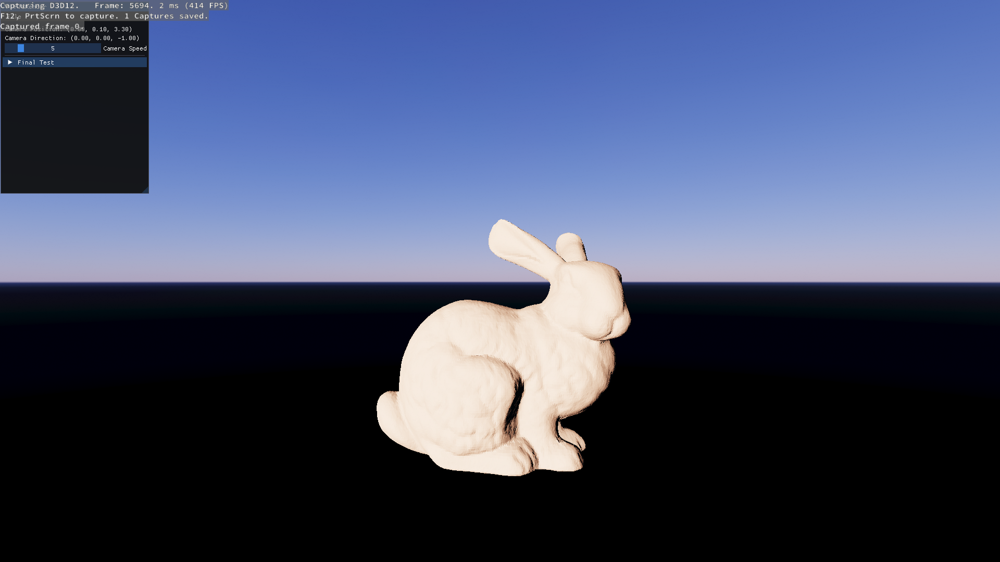

# GPU-Driven-SDF-DDGI

## Build

```powershell
git clone https://github.com/CellarCordial/GPU-Driven-SDF-DDGI.git
cd GPU-Driven-SDF-DDGI
xmake build GPU-Driven-SDF-DDGI
```

## Control

- Press mouse right button and `w, a, s, d, q, e`


## Display 
(gif may need time to load, please wait a moment.)


### Precomputed Atmospheric Scattering


### GPU Driven
#### Virtual Geometry


#### Nanite(Experimental)


#### Frustum & Hi-z Culling


#### Virtual Texture (All geometry texture)


